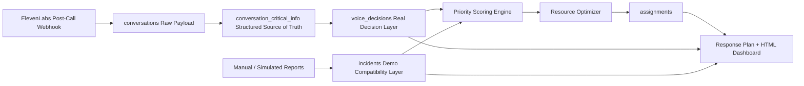

# ResQNet AI — Crisis Response Intelligence System

[](https://www.python.org/)
[](https://fastapi.tiangolo.com/)
[](https://www.sqlite.org/)
[](https://react.dev/)
[](https://www.typescriptlang.org/)
[](https://vite.dev/)
[](https://docs.pytest.org/)
[](https://openai.com/)
[](https://elevenlabs.io/)
[](https://sdgs.un.org/goals)


ResQNet AI is a hackathon prototype command center that turns emergency reports into classified incidents, priority scores, optimized resource assignments, and a coordinator-ready command briefing.


## Quickstart (HTML Command Center)

```bash
python -m venv .venv
source .venv/bin/activate
pip install -r requirements.txt
uvicorn app.main:app --reload --port 8000
```

Then open the dashboard at:

```
http://127.0.0.1:8000/dashboard
```

The Phase 7 dashboard is a cockpit-style HTML / CSS / vanilla-JS command center served directly by FastAPI from `static/dashboard/`. No extra dashboard server is needed for the main demo. Use **Run Full Judge Demo** for the recommended presentation path.

## One-Sentence Pitch

ResQNet AI helps crisis coordinators decide who needs help first, which limited resource should respond, and why the recommendation is fair, explainable, and operationally useful.

## Problem

Climate emergencies create a messy decision problem. Responders receive reports from callers, shelters, clinics, volunteers, and residents while resources such as ambulances, rescue teams, shelter buses, food, water, and power crews are limited.

The hard question is not only: what happened?

The harder question is: what should responders do first?

## Solution

ResQNet AI provides:

- Voice, manual, and simulated emergency-report intake.
- Structured voice-call records that make `conversation_critical_info` the source of truth for real caller reports.
- Deterministic classification that works without paid APIs.
- Priority scoring from 0-100 with mass-care escalation and low-severity dampening.
- Resource optimization using suitability, incident priority, capacity fit, and distance penalty.
- Unassigned-incident reasoning when resource capacity runs out.
- A polished HTML/CSS/JS command center with one-click judge demo mode.
- A command briefing with situation summary, priorities, deployment actions, risks, communications, and SDG alignment.

This is a prototype, not a production emergency system.

## Demo Outcome

The built-in Toronto flood simulation currently produces:

| Demo Result | Value |
| --- | ---: |
| Simulated emergency reports | 14 |
| Response resources | 10 |
| Optimized assignments | 10 |
| Estimated response-time savings | about 55% |
| Risk mix | Critical, High, Medium, and Low incidents |

The exact numbers can change as scoring and optimization logic evolves, but they reflect the current seeded demo flow.

## Hackathon Alignment

| Judging Category | How ResQNet AI Addresses It |
| --- | --- |
| Innovation | Combines voice-intake architecture, deterministic classification, mass-care scoring, explainable optimization, and command briefing. |
| Technical Implementation | FastAPI, SQLite/Postgres helpers, scoring engine, optimizer, planner, HTML command dashboard, tests, smoke test, and API docs. |
| Impact | Focuses on climate disaster response, vulnerable residents, shelter overload, medical needs, and scarce resources. |
| Usability & Design | Bright command-center dashboard with hero metrics, map, top priorities, deployment cards, and briefing panel. |
| Presentation | Includes demo script, Devpost copy, architecture doc, IBM alignment doc, and screenshot guidance. |

## UN SDG Alignment

- **SDG 3: Good Health and Well-Being** — Prioritizes medical emergencies, medication needs, oxygen needs, and vulnerable patients.
- **SDG 11: Sustainable Cities and Communities** — Supports city-level emergency coordination, shelter response, and resource dispatch.
- **SDG 13: Climate Action** — Demonstrates response planning for climate-driven floods, outages, shelter displacement, and supply shortages.

## IBM Alignment

ResQNet AI is honest about what is implemented today and where IBM technologies could extend it later.

- Current mode: classical, explainable, local hackathon prototype.
- Optimization model: incident-resource assignment matrix with objective scoring and operational constraints.
- Qiskit path: future QUBO or Ising-style constrained assignment model; no quantum advantage is claimed today.
- watsonx / Granite path: future replacement for optional LLM summarization and command-briefing generation.
- IBM Z / LinuxONE path: future resilient, secure transaction processing for mission-critical crisis coordination.
- Red Hat OpenShift / IBM Cloud path: future containerized deployment of intake, scoring, optimization, and dashboard services.

Detailed IBM framing is in [docs/ibm_alignment.md](docs/ibm_alignment.md).

## System Architecture



More detail is available in [docs/architecture.md](docs/architecture.md).

## Voice Data Architecture

Real voice-based emergency decisions originate from `conversation_critical_info`.
The raw ElevenLabs payload is stored in `conversations`, then already-processed
structured fields such as location, emergency type, affected people, vulnerable
people, critical needs, safety, and urgency are saved in
`conversation_critical_info`.

Each structured voice report creates or updates one `voice_decisions` record.
That real decision record is linked by `conversation_id` and `critical_info_id`,
so processing the same call twice updates the same voice decision instead of
creating duplicates. `incidents` remains for demo/manual compatibility only.
The optimizer can run against `voice_decisions` for real calls or `incidents`
for the judge demo flow.

## Key Features

- Preserved ElevenLabs post-call webhook intake.
- Existing conversation storage endpoints remain available.
- Deterministic classifier fallback when `OPENAI_API_KEY` is missing.
- Improved people-count extraction for families, residents, patients, crowds, and number words.
- Priority scoring with mass-care escalation and lower-severity dampening.
- Greedy optimizer with assignment score breakdowns.
- Unassigned-incident reasons.
- Optional `quantum_inspired` optimizer mode that reuses classical scoring and explains the future Qiskit path honestly.
- HTML/JS command center with one-click judge demo mode, outcome strip, Leaflet map, top incidents, resources, deployment cards, manual intake, and command briefing.
- Smoke test and unit/API tests.

## Tech Stack

| Layer | Technology |
| --- | --- |
| Backend | Python, FastAPI |
| Dashboard | HTML / CSS / vanilla JavaScript + locally vendored Leaflet (served by FastAPI StaticFiles) |
| Database | SQLite by default, Postgres-compatible helper logic |
| AI | Deterministic classifier, optional OpenAI structured outputs |
| Voice Intake | ElevenLabs post-call webhook architecture |
| Optimization | Explainable greedy resource assignment with Haversine distance |
| Testing | pytest, FastAPI TestClient, smoke test |

## Local Setup

### macOS / Linux

```bash
python -m venv .venv
source .venv/bin/activate
pip install -r requirements.txt
cp .env.example .env
```

### Windows PowerShell

```powershell
python -m venv .venv
.\.venv\Scripts\Activate.ps1
pip install -r requirements.txt
Copy-Item .env.example .env
```

## Environment Variables

```text
DATABASE_PATH=resqnet_voice.db
DATABASE_URL=
OPENAI_API_KEY=
OPENAI_MODEL=gpt-5.2
ELEVENLABS_API_KEY=
ELEVENLABS_WEBHOOK_SECRET=
API_BASE_URL=http://127.0.0.1:8000
```

`OPENAI_API_KEY` and `ELEVENLABS_WEBHOOK_SECRET` are optional for the local demo. Simulation, classification fallback, optimization, dashboard, and response planning all work without paid APIs.

## Run Backend

```bash
uvicorn app.main:app --reload --port 8000
```

## Run Dashboard

The dashboard is served by the same FastAPI process. After starting the backend, open:

```text
http://127.0.0.1:8000/dashboard
```

Recommended live-demo path:

1. Click **Run Full Judge Demo**.
2. Review Reports analyzed, Critical cases, Units deployed, Unassigned, and Response time saved.
3. Show the crisis map, deployment lines, top incidents, and command briefing.

## Smoke Test

```bash
python scripts/smoke_test.py
```

## Test Suite

```bash
pytest -q
```

## API Endpoints

| Method | Endpoint | Purpose |
| --- | --- | --- |
| GET | `/health` | Service health check |
| POST | `/webhooks/elevenlabs/post-call` | ElevenLabs post-call webhook intake |
| GET | `/conversations` | List saved voice conversations |
| GET | `/conversations/{conversation_id}` | Get one saved conversation |
| POST | `/process-conversations` | Backfill structured critical info and voice decisions |
| GET | `/critical-info` | List structured voice-call records |
| GET | `/voice-decisions` | List real voice-derived decision records |
| GET | `/voice-decisions/{voice_decision_id}` | Get one voice decision |
| PATCH | `/voice-decisions/{voice_decision_id}/status` | Update voice decision status |
| POST | `/incidents` | Create and classify a manual incident |
| GET | `/incidents` | List incidents |
| GET | `/incidents/{incident_id}` | Get one incident |
| PATCH | `/incidents/{incident_id}/status` | Update incident status |
| GET | `/resources` | List resources |
| POST | `/resources` | Create a resource |
| GET | `/assignments` | List assignments |
| POST | `/simulate-crisis` | Generate demo incidents and resources |
| GET | `/demo-data` | Return incidents, resources, assignments, and stats |
| POST | `/optimize-response` | Run greedy assignment; auto-selects voice decisions when present |
| POST | `/optimize-response?source=voice` | Optimize real voice decisions |
| POST | `/optimize-response?source=demo` | Optimize demo/manual incidents |
| POST | `/optimize-response?mode=quantum_inspired` | Run same classical scoring with quantum-inspired explanation |
| POST | `/generate-plan` | Generate emergency response plan; accepts `source=auto\|voice\|demo` |
| GET | `/metrics` | Return dashboard metrics; accepts `source=auto\|voice\|demo` |
| GET | `/ibm-alignment` | Return IBM extension-path explanation |

## API Examples

```bash
curl -X POST http://127.0.0.1:8000/simulate-crisis
curl -X POST http://127.0.0.1:8000/optimize-response
curl -X POST "http://127.0.0.1:8000/optimize-response?mode=quantum_inspired"
curl -X POST http://127.0.0.1:8000/generate-plan
curl http://127.0.0.1:8000/ibm-alignment
```

## Screenshots To Capture

No fake screenshots are included. For Devpost, capture:

- Hero dashboard with KPI cards and Judge Demo Flow.
- First viewport with outcome strip, Live Crisis Map, Mission Timeline, and Top Priority Incidents.
- Demo Outcome strip after **Run Full Judge Demo**.
- Official-looking Command Briefing.
- Resource Deployment cards with score breakdown details opened on one card.
- Manual report classification result.

## Demo Video

Use [docs/demo_script.md](docs/demo_script.md). The recommended 2-3 minute flow is:

1. Problem.
2. Product pitch.
3. Generate crisis scenario.
4. Optimize response.
5. Generate command briefing.
6. Explain architecture and IBM path.
7. Close on impact and SDGs.

## Technical Limitations

- The optimizer is classical and greedy, not full operations research.
- Distance uses Haversine straight-line distance, not live road routing.
- The dashboard tries OpenStreetMap tiles and falls back to a local grid-style operating picture if tiles are unavailable.
- No real IBM deployment, Qiskit execution, watsonx integration, or emergency-agency usage is claimed.
- Simulated data is used for demo reliability.
- The ElevenLabs webhook requires valid credentials and signed webhooks for real voice intake.

## Future Roadmap

- Route-aware travel-time estimates.
- Live SMS or WhatsApp reporting.
- Weather, flood, road, shelter, and clinic data feeds.
- watsonx.ai or Granite for multilingual summarization and briefing.
- Qiskit demonstration for a small constrained assignment matrix.
- Containerized deployment path for IBM Cloud or Red Hat OpenShift.
- Resilient transaction architecture inspired by IBM Z / LinuxONE.

## Team Workstreams

| Workstream | Responsibility |
| --- | --- |
| Frontend and dashboard | HTML command center, map, screenshots, demo flow |
| Backend and APIs | FastAPI routes, persistence, local setup, endpoint validation |
| AI and scoring | Classification, fallback logic, priority scoring, explanations |
| Optimization and data | Scenario simulation, resource matching, score breakdowns |
| Pitch and submission | Devpost copy, demo video, architecture narrative, SDG and IBM framing |
