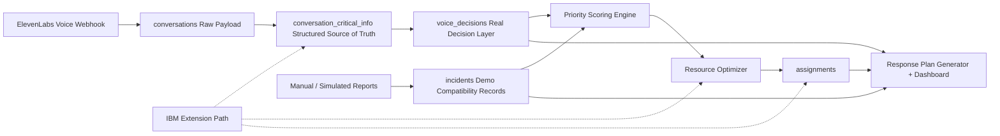

# ResQNet AI Architecture

ResQNet AI is organized as a modular crisis-response pipeline. The current implementation runs locally for the hackathon demo and is designed so each layer can later be swapped for stronger AI, optimization, or deployment infrastructure.

## Data Flow

1. ElevenLabs voice webhooks store the full raw payload in `conversations`.
2. Already-processed ElevenLabs fields are normalized into `conversation_critical_info`.
3. Real voice-based decision records are stored in `voice_decisions`.
4. `incidents` remains as a compatibility table for manual intake and simulation.
5. Manual dashboard input and simulator data can still create incidents directly.
6. The scoring engine assigns a 0-100 priority score to real voice decisions and demo incidents.
7. The optimizer assigns suitable resources to high-priority `voice_decisions` in real mode or `incidents` in demo mode.
8. The planner generates a command briefing.
9. The dashboard presents the judge demo flow: scenario, optimization, briefing.

## Component Responsibilities

| Component | Responsibility |
| --- | --- |
| FastAPI app | API routing, webhook intake, validation, CORS, and response shaping |
| Conversation critical info | Structured source of truth for real ElevenLabs call reports |
| Voice decisions | Idempotent real decision records derived from structured voice reports |
| Incidents | Demo/manual compatibility records for the existing judge flow |
| Classifier | Keyword and phrase-based deterministic extraction with optional OpenAI enhancement |
| Scoring engine | Urgency, need severity, people affected, vulnerability, mass-care escalation, and severity dampening |
| Database layer | SQLite-first persistence with Postgres-compatible helper logic |
| Optimizer | Explainable resource assignment using suitability, priority, distance, and capacity |
| Planner | Coordinator-readable situation summary, priorities, actions, risks, communications, and SDG alignment |
| Dashboard | FastAPI-served HTML/CSS/JavaScript command center for demo storytelling, map, cards, tables, and manual intake |
| Tests | Classifier, scoring, optimizer, API flow, dashboard syntax, and smoke test validation |

## Classification Engine

The classifier is intentionally deterministic for hackathon reliability. It handles:

- Need types such as medical, rescue, shelter, food, water, power, and transportation.
- Vulnerability indicators such as elderly, children, disabled, injured, pregnant, and hospital context.
- People-count phrases such as “family of five,” “about 80 people,” “elderly couple,” and “three families.”
- Optional OpenAI structured outputs if an API key is configured.

## Priority Scoring Engine

The scoring engine combines:

- Urgency level.
- Need severity.
- People affected.
- Vulnerability indicators.
- Time-sensitive keywords.
- Mass-care escalation for food, water, and shelter incidents affecting many people.
- Severity dampening for minor injuries and supplies-only requests.

The output includes a score, risk tier, explanation, and score breakdown.

## Optimizer

The optimizer is a classical, explainable greedy selector:

1. Sort selected decision records by priority.
2. Score suitable available resources for each decision record.
3. Use resource match, priority weight, distance penalty, and capacity bonus.
4. Assign the best resource.
5. Mark the resource unavailable.
6. Return unassigned decision records with reasons.

It preserves demo reliability through `source=demo`, while `source=voice` optimizes real `voice_decisions`.

## IBM Extension Path

The current repo does not claim live IBM deployment, watsonx integration, or quantum advantage. The architecture is designed for future IBM-aligned extensions:

| IBM Capability | Possible Extension |
| --- | --- |
| Qiskit | Encode the assignment matrix as a QUBO or Ising-style constrained optimization demo |
| watsonx.ai / Granite | Replace optional LLM summarization and command briefing with IBM-hosted models |
| IBM Z / LinuxONE | Secure, resilient incident transaction processing and auditability |
| Red Hat OpenShift / IBM Cloud | Containerized crisis microservices for intake, scoring, optimization, and dashboard |

More detail is available in [ibm_alignment.md](ibm_alignment.md).
